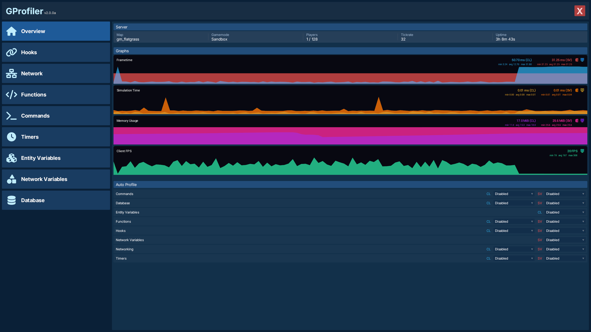
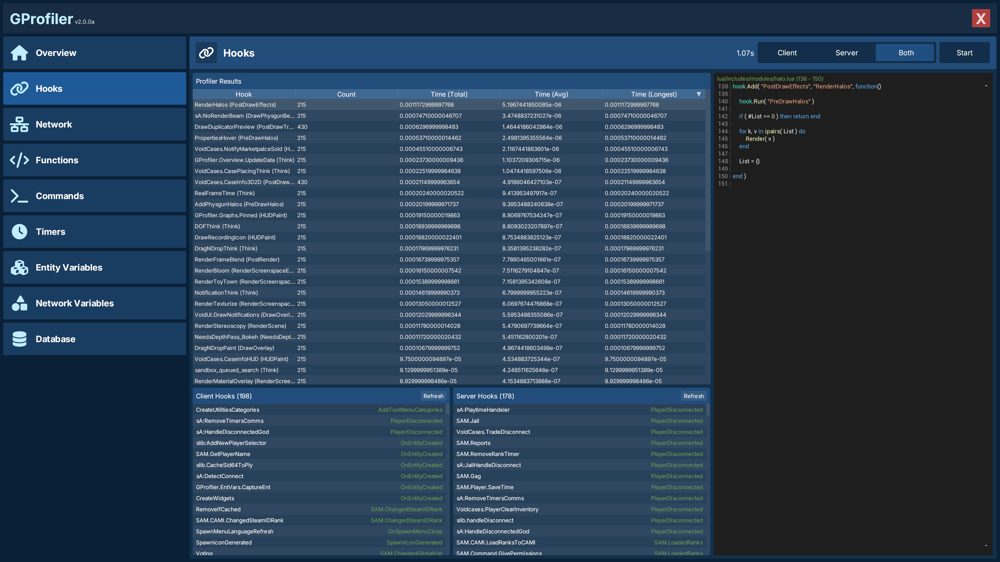
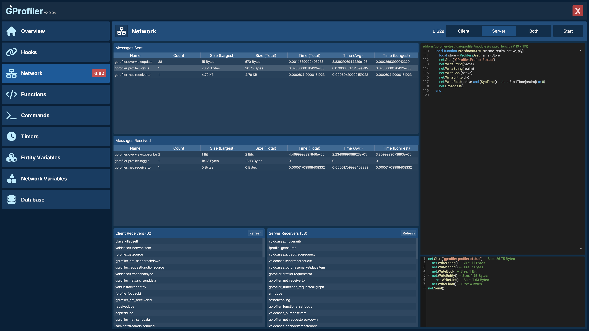
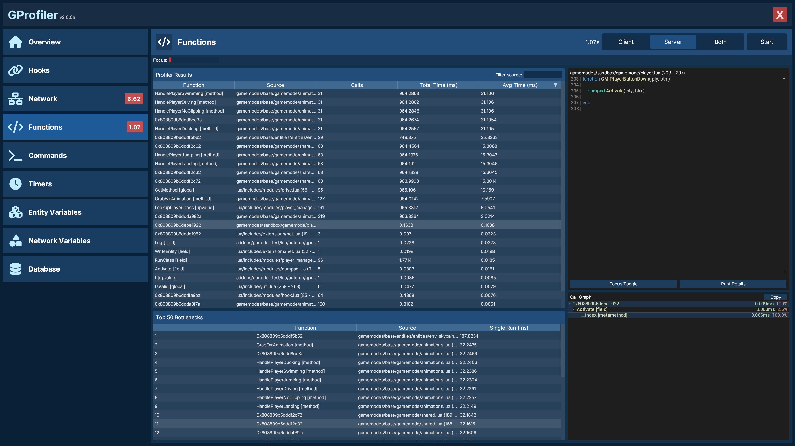
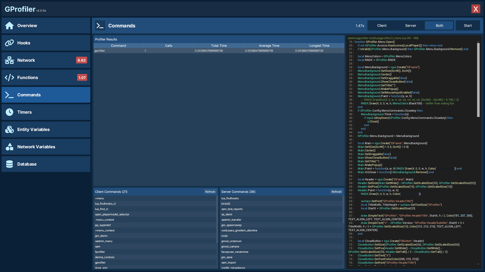
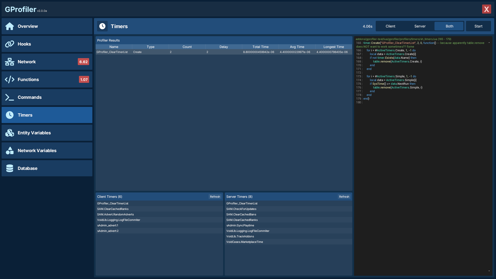
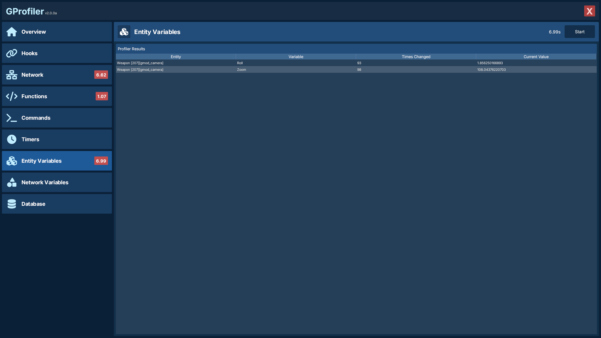
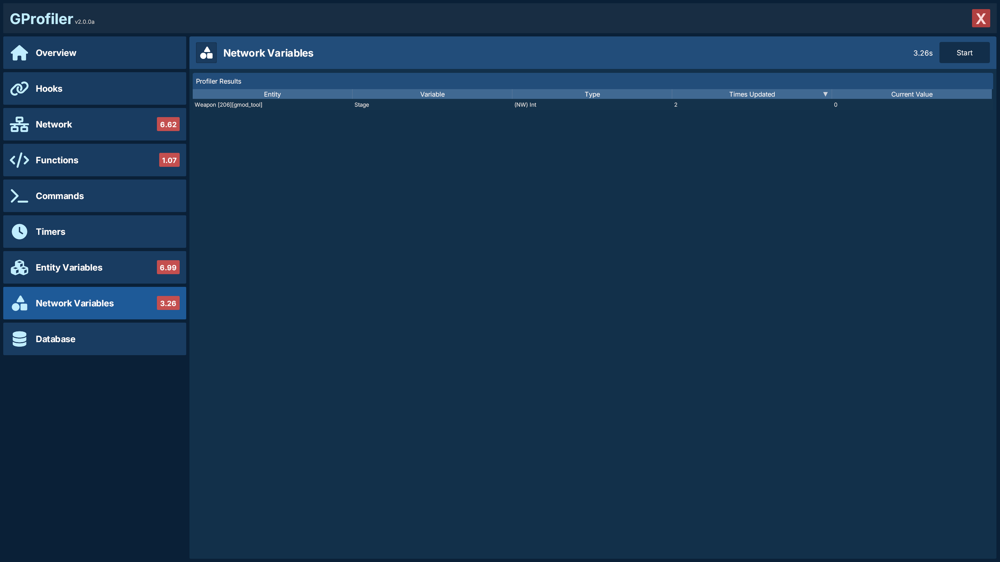
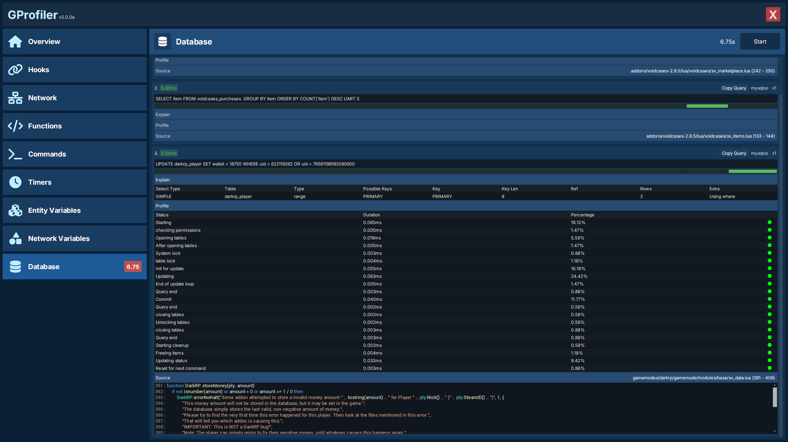
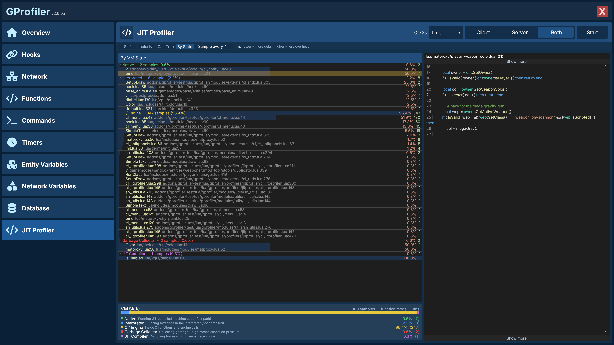

# 📊 GProfiler

## 📑 Contents

- [Overview Tab](#-overview-tab)
- [Profilers](#-profilers)
	- [Hooks](#-hook-profiler)
	- [Network](#-net-profiler)
	- [Functions](#️-function-profiler)
	- [Commands](#️-commands-profiler)
	- [Timers](#️-timer-profiler)
	- [Entity Variables](#-entity-variables-profiler)
	- [Network Variables](#-network-variables-profiler)
	- [Database](#️-database-profiler)
	- [JIT](#-jit-profiler)
- [Configuration](#-configuration)

---

## 🏠 Overview Tab

	

---

## 🔬 Profilers

### 🪝 Hook Profiler

	

---

### 🌐 Net Profiler

	

---

### ⚙️ Function Profiler

	

#### Call graph

Select any result to view the call tree of a single invocation: which functions it called, in order, with each child's time and share of the parent. This makes it easy to see *where* a slow function actually spends its time.

> [!NOTE]
> The call graph may provide incomplete results, or often none at all. It's an experimental idea I had, and can be a bit janky

#### Focus

You can set a list of functions to limit the profiling results to, making it easy to focus on a small set of functions at a time, while discarding other data

---

### 🖥️ Commands Profiler

	

---

### ⏱️ Timer Profiler

	

---

### 📦 Entity Variables Profiler

	

---

### 🔗 Network Variables Profiler

	

---

### 🗄️ Database Profiler

	

- **EXPLAIN** gives into how the database executes a query: the execution plan, index usage, table scans and other factors, so you can see where inefficiencies lie.
- **PROFILE** gives a detailed execution breakdown showing what the server was doing at each step and how long each step took.

> [!NOTE]
> Both of the above is only available for databases running through MySQL, and all data is provided by MySQL

---

### 🔥 JIT Profiler

	

> [!NOTE]
> The JIT Profiler requires the `gprofiler` binary module, which you can download here: TODO
> The module is currently only built for windows.

---

## 🔧 Configuration

All configuration lives in `lua/gprofiler/sh_config.lua`, this is where you can configure who can use GProfiler, language, etc. Players whos SteamID's are in `GProfiler.Config.AllowedSteamIDs` can use GProfiler.
